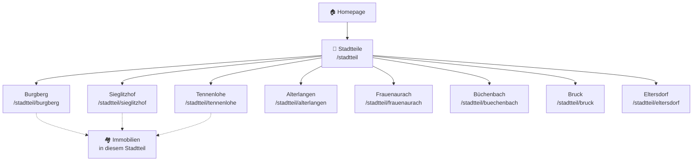
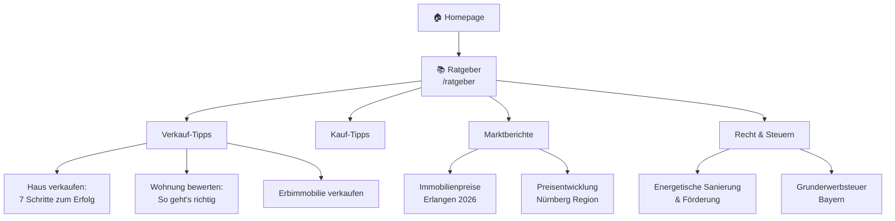
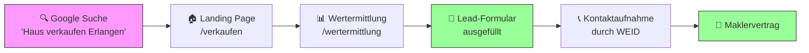
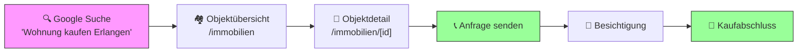
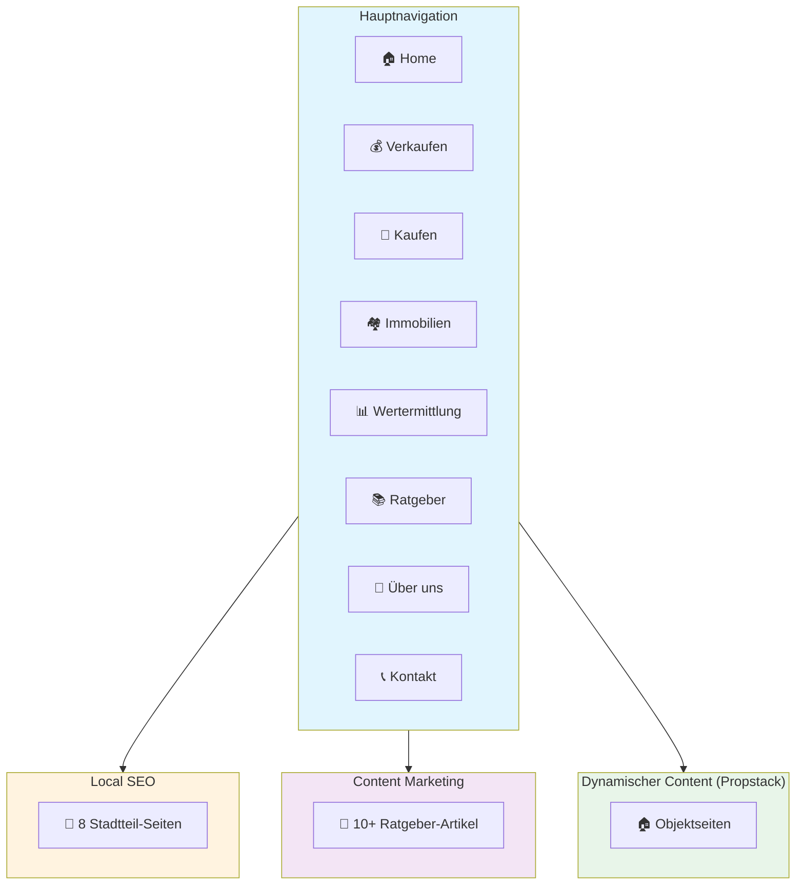

# Website-Architektur: WEID Immobilien

Diese Sitemap zeigt die geplante Seitenstruktur als Flowchart. Das Diagramm wird direkt in GitHub gerendert (Mermaid-Format).

## Haupt-Sitemap

```mermaid
flowchart TD
    HOME["🏠 Homepage<br/>/"]
    
    %% Hauptnavigation
    HOME --> VERKAUFEN["💰 Verkaufen<br/>/verkaufen"]
    HOME --> KAUFEN["🔑 Kaufen<br/>/kaufen"]
    HOME --> IMMOBILIEN["🏘️ Immobilien<br/>/immobilien"]
    HOME --> WERTERMITTLUNG["📊 Wertermittlung<br/>/wertermittlung"]
    HOME --> RATGEBER["📚 Ratgeber<br/>/ratgeber"]
    HOME --> UEBER["👥 Über uns<br/>/ueber-uns"]
    HOME --> KONTAKT["📞 Kontakt<br/>/kontakt"]

    %% Verkaufen Unterseiten
    VERKAUFEN --> V_HAUS["Haus verkaufen<br/>/verkaufen/haus"]
    VERKAUFEN --> V_WOHNUNG["Wohnung verkaufen<br/>/verkaufen/wohnung"]
    VERKAUFEN --> V_GRUNDSTUECK["Grundstück verkaufen<br/>/verkaufen/grundstueck"]
    VERKAUFEN --> V_GEWERBE["Gewerbe verkaufen<br/>/verkaufen/gewerbe"]

    %% Kaufen Unterseiten
    KAUFEN --> K_HAEUSER["Häuser<br/>/kaufen/haeuser"]
    KAUFEN --> K_WOHNUNGEN["Wohnungen<br/>/kaufen/wohnungen"]
    KAUFEN --> K_GRUNDSTUECKE["Grundstücke<br/>/kaufen/grundstuecke"]
    KAUFEN --> K_GEWERBE["Gewerbe<br/>/kaufen/gewerbe"]

    %% Immobilien (Propstack-Feed)
    IMMOBILIEN --> IMM_DETAIL["📄 Objektdetail<br/>/immobilien/[id]"]

    %% Über uns
    UEBER --> TEAM["Team<br/>/ueber-uns/team"]
    UEBER --> KARRIERE["Karriere<br/>/ueber-uns/karriere"]
```

## Stadtteil-Seiten (Local SEO)

## Ratgeber-Struktur (Content Marketing)

## User Journey: Verkäufer

## User Journey: Käufer

## Gesamtstruktur (Übersicht)

---

## Technische Hinweise

### URL-Struktur
- Alle URLs in Kleinbuchstaben
- Bindestriche statt Unterstriche
- Keine Umlaute in URLs (ä → ae, ö → oe, ü → ue)
- Beispiel: `/stadtteil/buechenbach` statt `/stadtteil/büchenbach`

### Empfohlene Seitenanzahl für Launch
| Kategorie | Anzahl Seiten |
|-----------|---------------|
| Hauptseiten | 7 |
| Stadtteil-Seiten | 8 |
| Ratgeber-Artikel | 5 (Start) |
| **Gesamt MVP** | **~20 Seiten** |

### Priorisierung
1. ⭐⭐⭐ Homepage, Verkaufen, Wertermittlung, Kontakt
2. ⭐⭐ Stadtteil-Seiten (Burgberg, Sieglitzhof, Tennenlohe)
3. ⭐ Ratgeber-Artikel, weitere Stadtteile
